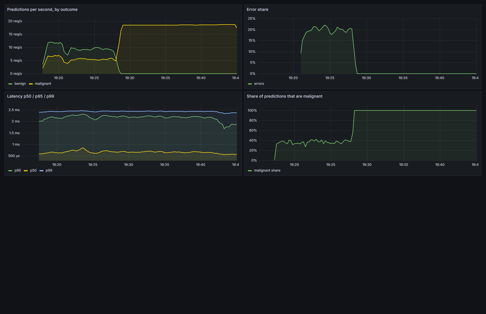

# Tutorial 04 — Prometheus and Grafana: run evidence

DDM501 · Bonus 2 · Võ Minh Sang (25MS13286)

The stack was run with `docker compose up --build` (API on :18000, Prometheus on :19090, Grafana on :13000), and
every exercise in the tutorial was carried out against it. All numbers and screenshots below come from that run.

## 1. The five questions, answered by the metrics

| Question | Metric / query |
|---|---|
| How many predictions has it served? | `sum(wdbc_predictions_total)`: **Counter** |
| What fraction of requests are failing? | `sum(rate(wdbc_errors_total[5m])) / (sum(rate(wdbc_predictions_total[5m])) + sum(rate(wdbc_errors_total[5m])))`: a ratio of rates |
| Is it slower than last Tuesday? | `histogram_quantile(0.95, sum(rate(wdbc_prediction_latency_seconds_bucket[5m])) by (le))`: **Histogram** |
| Which model version is serving? | `wdbc_model_info{version=...}`: the info pattern (a **Gauge** fixed at 1, with labels) |
| Same mix of answers as at deployment? | `wdbc_malignant_share`: a **Gauge** that moves with the data rather than with the traffic |

## 2. Watch it happen (section 5)

Traffic ran at 20 req/s throughout, using `scripts/traffic.py`. Alert states were read from the Prometheus API at
the end of each stage ([`evidence/alerts_timeline.txt`](evidence/alerts_timeline.txt)).

| Stage (UTC) | Traffic | What moved | Alert |
|---|---|---|---|
| 12:17–12:20 healthy | 3,324 requests, 0 failed | Baseline: malignant share ~37%, p95 ~2.2 ms | none |
| 12:20–12:27 `--broken 0.2` | 7,806 requests, 1,567 failed (20.1%) | Error share climbs to ~20% | **HighErrorRate firing** (after `for: 5m`) |
| 12:27–12:44 `--drift 3.0` | 18,943 requests, **0 failed** | Latency flat, errors 0%, **malignant share 37% → 100%** | **MalignantShareShift firing** (after `for: 15m`) |
| 12:44–12:47 `docker compose stop api` | none | Predictions/s fall to 0 | **ApiDown firing** (after `for: 1m`) |

The middle row is the one that matters. Every engineering signal said the service was healthy, and it was. The
inputs had changed, and the only thing that noticed was the one metric that exists because this is an ML service.

| Stage | Dashboard | Alerts |
|---|---|---|
| healthy | [grafana_1_healthy.png](evidence/grafana_1_healthy.png) | [prometheus_alerts_1_healthy.png](evidence/prometheus_alerts_1_healthy.png) |
| broken 20% | [grafana_2_broken.png](evidence/grafana_2_broken.png) | [prometheus_alerts_2_broken.png](evidence/prometheus_alerts_2_broken.png) |
| drift 3σ | [grafana_3_drift.png](evidence/grafana_3_drift.png) | [prometheus_alerts_3_drift.png](evidence/prometheus_alerts_3_drift.png) |
| API stopped | [grafana_4_api_down.png](evidence/grafana_4_api_down.png) | [prometheus_alerts_4_api_down.png](evidence/prometheus_alerts_4_api_down.png) |

## 3. Label cardinality (section 6)

Identical traffic (`traffic.py --rps 30 --seconds 20 --broken 0.1`), counted with `scripts/count_series.py`
([`evidence/cardinality.txt`](evidence/cardinality.txt)):

|  | Sensible labels (`T04_TRAP=0`) | With `sample_id` label (`T04_TRAP=1`) |
|---|---:|---:|
| `wdbc_predictions_total` series | 2 | **326** |
| Total time series | **23** | **671** |
| `/metrics` payload | 3,248 bytes | 54,153 bytes |
| Growth | constant | one new series per patient, forever |

That is 29 times as many series for the same traffic. The count of 23 stays 23 whether the service handles a hundred
requests or a million. The `sample_id` version keeps growing with every new patient, and those series are never
collected. The rule this demonstrates: **a label may only take values from a small, bounded set that is known in
advance** (outcome, status code, model version), and never an id, a timestamp or anything a user supplies.

## 4. Why each alert exists

| Alert | Fires when | What it catches that the others miss |
|---|---|---|
| ApiDown | `up == 0` for 1m | The *absence* of a scrape. A dead process cannot report its own death |
| ModelNotLoaded | `wdbc_model_loaded == 0` for 2m | The port answers, but every prediction returns 503 |
| HighErrorRate | error share > 5% for 5m | A ratio, so 40 errors means the same thing at 100 and at 10k requests |
| SlowPredictions | p95 > 50 ms for 10m | The tail, where the users who are actually suffering are |
| MalignantShareShift | share moves > 15 points for 15m | Nothing broken, but the answers changed. This failure mode exists only in ML services |
