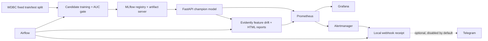

# DDM501 Bonus 2 — WDBC monitoring and guarded retraining

Võ Minh Sang · 25MS13286

This extends the course Tutorial 04 WDBC starter. It connects model versioning,
feature drift, orchestration and alert delivery while preserving the original
prediction contract and historical T04 evidence.

## Architecture



MLflow uses SQLite and a named volume for artifacts. Airflow uses `standalone`
with the SequentialExecutor. These choices suit a local coursework demo; this
repo does not claim a production deployment. PostgreSQL, MinIO and extra workers
are unnecessary for the behavior demonstrated here.

## Run from a clean checkout

Docker Desktop must use Linux containers; allow at least 6 GB RAM.

```bash
docker compose up -d --build --wait --wait-timeout 300
docker compose exec -T api python -m pytest -q tests/
docker compose exec -T api python scripts/verify_stack.py
python scripts/verify_airflow.py
```

The last command runs on the host and needs only Python's standard library.
Run it after `verify_stack.py`, which leaves a normal feature window.

The image trains a local fallback model during build. With Compose, API startup
registers the initial model in MLflow and loads the `champion` alias. No local
virtual environment, downloaded dataset or prebuilt model is needed.

| Service | Local URL |
|---|---|
| Prediction API | http://127.0.0.1:18000/docs |
| MLflow registry | http://127.0.0.1:15010 |
| Evidently and reports | http://127.0.0.1:18001/docs |
| Alert receiver | http://127.0.0.1:18002/docs |
| Prometheus | http://127.0.0.1:19090 |
| Alertmanager | http://127.0.0.1:19093 |
| Grafana | http://127.0.0.1:13000 (anonymous viewer) |
| Airflow | http://127.0.0.1:18081 |

All published ports bind to localhost. Airflow creates the local `admin` password;
read it privately with `docker compose exec airflow cat /opt/airflow/standalone_admin_password.txt`.

## What the extension does

- **Quality gate:** a candidate must achieve holdout ROC AUC >= 0.95 and must not
  trail the current champion by more than 0.005. Every candidate is tracked and
  registered; rejection preserves the champion alias and the serving model.
  The `dummy` candidate deliberately obtains AUC 0.5 to demonstrate rejection.
- **Fixed evaluation:** clean the supplied WDBC CSV, split 80/20 with stratification
  and seed 42. Retraining uses the same source and holdout; it does not claim to
  correct drift in a changed population without new labeled data.
- **Feature drift:** Evidently compares the last 200 captured predictions with
  the training reference. At least 100 samples are required; drift is detected
  when at least 30% of input features drift. The buffer holds at most 1,000 rows.
  This is separate from the original malignant-prediction-share alert.
- **Airflow:** `service_health_check` every 15 minutes; `drift_monitoring` hourly;
  `model_retrain` manually or after detected drift. Failure callbacks and result
  summaries are sent to the local receiver. An empty drift window skips analysis.
- **Alert delivery:** Prometheus -> Alertmanager -> local webhook, including firing
  and resolved events. Requests are persisted in a dedicated volume.
- **Grafana:** original T04 dashboard plus `WDBC Feature Drift and Registry`.
- **CI:** checks configs, regression tests, DAG imports and the complete Docker
  integration path. It uploads the measured runtime evidence.

## Operations and optional Telegram

`/ops/retrain`, drift capture/analysis and notification history require
`X-Ops-Token`. The documented local default is `tutorial-local-only`; change
`OPS_TOKEN` via `.env` if needed. `.env` is ignored by Git.

Telegram is **disabled and not required for verification**. To opt in, copy
`.env.example` to `.env`, populate the bot token and chat ID privately, set
`TELEGRAM_ENABLED=1`, then recreate the notifier. A delivery is recorded as
`telegram` only after Telegram returns success. Current evidence uses `local`;
it does not claim a real Telegram message was sent.

## Evidence and provenance

[Historical T04 run and extension results](EVIDENCE.md).
[Measured extension checks](evidence/extended/runtime-checks.json).

The data/API baseline comes from the supplied `DDM501_T04_Monitoring.pdf` and
`ddm501-t04-monitoring` starter. The supplied `ml-monitoring-full-version` starter
provides the feature-drift design reference.
